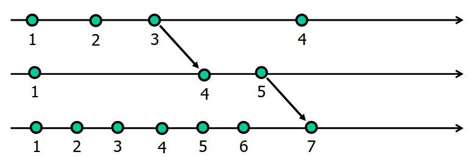

# 1
- V
- F
- V
- F
- V
- V
- F
- F
- V
- V
- V
- ? (Dever, devia mas basta esperar pela maioria)
- V
- V

# 2
## a)
```
a3: a1, a2
```
```
c4: c1, c2, c3,
    b1, b2, b3,
    a1, a2
```
## b)
```
a2: 2
a3: 3
b2: 4
c2: 6
a5: 8
```
## c)
Não é possível, exemplo em que falha



# 3
## a)
Sim, dado que a mensagem da Alice para o Bob está encriptada com a chave da Alice, só ela ou o KDC a podem descodificar. 
O facto de o Bob poder informar o KDC que a mensagem deve ser desencriptada com a chave de A, 
o conteúdo ser desencriptado pelo KDC, consequentemente encriptado com a chave do Bob e por fim o Bob poder ter acesso a Ks
mostra que a mensagem veio da Alice.

No entanto, assume-se que a mensagem M foi de facto escrita originalmente pela Alice, se juntarmos a probabilidade da Alice estar
meramente a passar a mensagem, não temos garantias pois a Ks pode ter sido passada juntamente com a mensagem.

## b)
Quando Bob envia H(M + Na), a Alice pode verificar se consegue gerar a mesma hash, 
se algo foi adulterado, por corrupção ou malícia, as hashes não serão iguais.

## c)
Assume-se que a Alice não possui qualquer tipo de chave

### Alice -> Bob : {M, Na}K(pubB)
Alice envia uma mensagem encriptada pela chave pública de Bob juntamente com um nonce
Bob procede à desencriptação com a sua chave privada

### Bob -> Alice : {H(M, Na)}K(privB)
Bob encripta o hash da mensagem e o nonce de volta com a sua chave privada
Alice desencripta com a chave pública de Bob
Verifica se a sua mensagem mais o nonce enviado, quando hashed, são iguais ao resultado de Bob

# 4
## a)
Total

## b)
Total

## c)
Total

## d)

# 5
## a)

## b)

# 6
## a)
Para um sistema grande o suficiente, o servidor pode sofrer o azar de gerar sempre o mesmo grupo de aleatórios sendo mantém assim a maioria do sistema "às escuras".
Nem com as leituras dos clientes o servidor consegue manter-se "a par" pois estes podem verificar versões com outros servidores "outdated".

## b)
Sim porque nada garante que o algoritmo faça escritas em todos os servidores e mantenha o sistema atualizado. 
Desta forma os utilizadores podem facilmente aceder a conteúdo desatualizado

## c)
A replicação não deve ser feita pelo cliente, os servidores secundários podem ativamente verificar o seu estado contra outros servidores "vizinhos"
mantendo assim a rede atualizada. Se o esquema for implementado em anel sabemos que as réplicas vão sendo propagadas ao longo do tempo e todas elas chegarão a toda a rede.