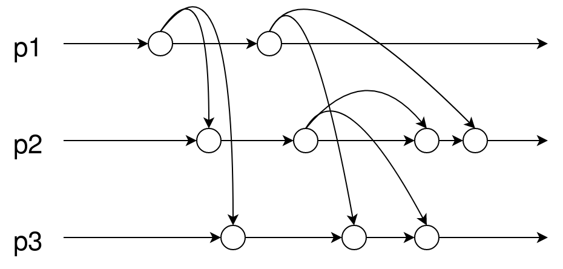
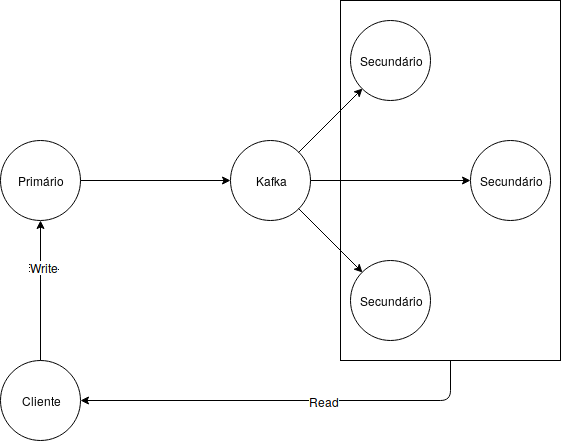

# 1
- F
- F
- V
- V
- F
- F
- F
- V
- F
- V
- F
- V
- V
- F
- F
- V

# 2
## a)
```
b5: a1, a2, a3, a4,
    b1, b2, b3, b4,
    c1, c2, c3
```
```
c5: c1, c2, c3, c4,
    b1, b2, b3
```
## b)
```
a2: [2, 0, 0]
```
```
a5: [5, 0, 0]
```
```
b3: [0, 3, 1]
```
```
b6: [4, 6, 4]
```
```
c3: [0, 3, 3]
```

## c)
|   |   |   |
|---|---|---|
| 1 | `b2: [0, 2, 1]` | `c2: [0, 0, 2]` |
| 2 | `a1: [1, 0, 0]` | `b2: [0, 2, 1]` |
| 3 | `a1: [1, 0, 0]` | `c2: [0, 0, 2]` |
| 4 | `a5: [5, 0, 0]` | `c5: [0, 3, 5]` |
| 5 | `a3: [3, 0, 0]` | `c5: [0, 3, 5]` |

# 3
## a)
No protocolo de Needam-Schroeder com chaves simétricas é utilizado um centro de distribuição de _chaves_.

## b) 
Nos protocolos de segurança utiliza-se o conceito de “nonce” para evitar ataques de _replaying_.

## c) 
Para evitar ataques por interposição (“man in the middle”) é necessário que a chave pública do servidor utilizada pelo cliente seja _encriptada_.

## d) 
Num sistema seguro a trusted computing base deve ser _o mais minimalista possível_.

## e) 
Evitar o repúdio de mensagens pode ser conseguido por recurso a _certificados_.

## f) 
Uma função síntese segura serve principalmente para garantir a _integridade e origem_ das
mensagens.

## g) 
A Alice enviou uma mensagem secreta ao Bob. A mensagem foi cifrada com a _chave privada da Alice_.

## h) 
A Alice enviou uma mensagem m secreta ao Bob, usando o protocolo de Needam-Schroeder. A mensagem chave de sessão que cifrou a mensagem foi gerada _pelo KDC_.

# 4
## 1)
A, V1, Ks (?), H(V1, Ks)

## 2)
S, V2, Ks (?), H(V2, Ks)

## b)
A hash é baseada numa chave "privada" e no valor do cupão, desta forma um atacante, usando o mesmo algoritmo de hashing não consegue replicar o resultado dado que não tem acesso à chave privada.

`H(V, Ks) != H(V, K')`

# 5
## a)
`(B, F), (C, G), (D, G)`

## b)
`(B, F)`

# 6
Assumindo que apenas __p1__ escreve para os outros canais, a estrutura descrita é suficiente para garantir ordem causal, dado que uma mensagem _mn_ de __p1__ não chegará antes de _mn-1_.

No entanto, se outros processos também escreverem, não chega para garantir ordem causal como demonstrado no exemplo abaixo:



# 7
## a)
Constitui um serviço de diretório pois apenas é possível obter os nomes dos servidores (através do _list_) e não informação "concreta" sobre cada um

## b)
### i)
Apenas é necessário que a escrita seja efetuada na maioria dos servidores secundários

### ii)
Não, porque cada escrita é efetuada em _n-1_ servidores, desta forma apenas 1 estará desatualizado perante a última escrita, se o cliente fizer um pedido a esse servidor, quando este comparar as versões com outro, "perceberá" que está desatualizado, procedendo a uma atualização.

## c)
Callback Promise, pois permite ter a certeza de que a versão que temos da lista será sempre a mais recente

## d)
Sim.

